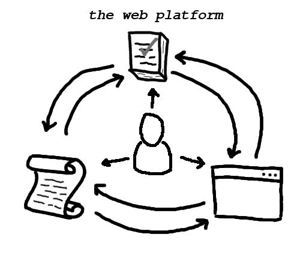

# "Introduction to WPT" video transcript

<iframe
  width="560"
  height="315"
  src="TODO"
  frameborder="0"
  allow="autoplay; encrypted-media"
  allowfullscreen></iframe>

**Still image of the WPT logo**

> Hello, and welcome to the Web Platform Tests!
>
> The goal of this project is to ensure that all web browsers present websites
> in exactly the way the websites' authors intended.
>
> But what is the web platform, exactly? You can think of it as having three
> main parts.

**A top-down shot of a blank sheet of graph paper**

> First, there are the web browsers.

A hand places a paper cutout depicting a browser window in the lower-right
corner of the sheet.

> Applications like Firefox, Chrome, and Safari allow people to interact with
> pages and with each other.
>
> Second, there are the web standards.

A hand places a paper cutout depicting a scroll of parchment paper in the
lower-left corner of the sheet.

> These documents define how the browsers are supposed to behave.

**A recording of a browser visiting https://platform.html5.org/**

> That includes everything from how text is rendered to how augmented reality
> apps are built. Specifying it all takes a huge amount of work!

The browser clicks through to the Fetch standard and begins scrolling.

> And as you might expect, the standards can get really complicated.

**Return to the graph paper**

A hand draws an arrow from the cutout of the scroll to the cutout of the
browser window.

> The people who build the browsers use the specifications as a blue print for
> their work. A shared set of generic instructions like these make it possible
> for people to choose between different browsers, but only if the browsers get
> it right.

A hand places a cutout representing a stack of papers on the top-center of the
sheet and draws an arrow from that cutout to the cutout of the browser window.

> To do verify their work, the browser maintainers rely on the third part of
> the web platform: conformance tests.

A hand draws an arrow from the cutout of the scroll to the cutout of the tests.

> We author tests to describe the same behavior as the standards, just
> formatted in a way that a computer can understand.

A hand draws an arrow from the cutout of the browser window to the cutout of
the scroll.

> In the process, the maintainers sometimes uncover problems in the design of
> the specifications and recommend changes to fix them.

A hand draws an arrow from the cutout of the tests to the cutout of the scroll.

> Test authors also find and fix these so-called "spec bugs."

A hand draws an arrow from the cutout of the browser window to the cutout of
the tests.

> ...and as they implement the standards, the maintainers of each browser
> frequently write new tests that can be shared with the others.
>
> This is how thousands of people coordinate to build the cohesive programming
> platform that we call the world wide web. The web-platform-tests project is
> one of the test suites that make this possible.
>
> That's pretty abstract, though! Let's take a quick look at the tests
> themselves.

**A recording of a web browser**

`http://web-platform-tests.live` is entered into the location bar, and the
browser loads the page.

> The latest version of the tests are publicly hosted in executable form on the
> web at web-platform-tests.live.

The browser begins scrolling through the enormous list of directories.

> There, were can navigate among all the tests for all the different web
> technologies.
>
> Let's take a look at a typical test.

The browser stops scrolling, and a mouse cursor clicks on `fetch`, then `api`,
then `headers`, and finally `headers-basic.html`.

> This test is written with WPT's testing framework, testharness.js. The test
> completes almost instantly, and testharness.js reports that this browser
> passes all but one subtest. To understand the failure, we can read the source
> code.

The mouse opens a context menu, selects "View Source", and scrolls to the
source of the failing test.

> It looks like the failing subtest is for what happens when a `Headers`
> instance has a custom JavaScript iterator method. That's a strange edge case,
> but it's important for browsers to agree on every detail!

`https://web-platform-tests.org` is entered into the location bar, and the
browser loads the page.

> Other types of tests include "reftests" (for verifying the visual rendering
> of web platform features) and "manual tests" (for cases where a computer
> can't automatically verify the expected behavior). You can read more about
> all the test types in the project documentation at
> [web-platform-tests.org](https://web-platform-tests.org).

`https://wpt.fyi` is entered into the location bar, and the browser loads the
page.

> [wpt.fyi](https://wpt.fyi) is a great way to see how today's browsers are
> performing on the web-platform-tests.

The browser scrolls to `fetch`, and a mouse cursor clicks on `fetch`, then
`api`, then `headers`, and finally `headers-basic.html`.

> Here, you'll find all the same tests, just presented with the results from
> various browsers.

`https://web-platform-tests.live/LICENSE.md` is entered into the location bar,
and the browser loads the page.

> The web-platform-tests project is free and open source software. From bug
> reports to documentation improvements and brand new tests, we welcome all
> sorts of contributions from everyone.

`https://github.com/web-platform-tests/wpt` is entered into the location bar,
and the browser loads the page.

> To get involved, you can visit the project management site...

`http://irc.w3.org/` is entered into the location bar, and the browser loads
the page. `web4all` is entered as the Nickname, and `#testing` is entered as
the channel name. A mouse clicks on the "Connect" button.

> ...log in to the chat room on IRC...

`https://lists.w3.org/Archives/Public/public-test-infra` is entered into the
location bar, and the browser loads the page.

> ...or join the mailing list.

**Return to the graph paper**

A hand places a paper cutout depicting a human silhouette on the sheet. It then
draws arrows from the new cutout to each of the three previously-introduced
cutouts.

> We're looking forward to working with you!
